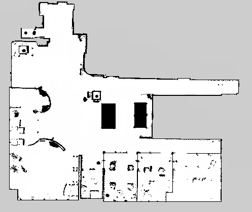
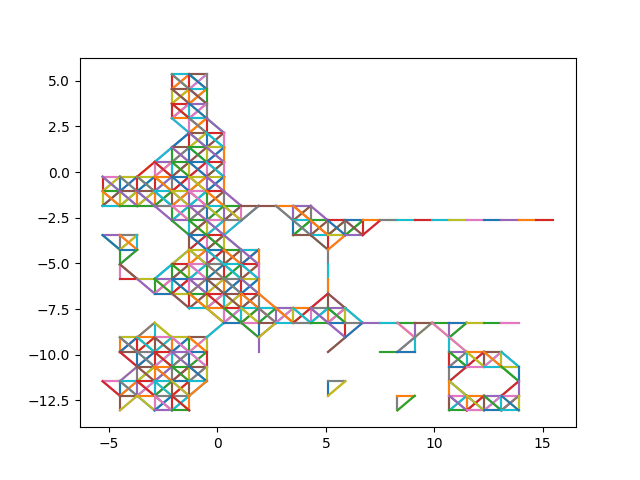

# Grid-based Path Generator

This code generates possible paths in the 2D LiDAR map (.pgm format).
The generated map can be used to find the shortest path using the A-star algorithm efficiently.
This method is faster than the path computation in the SLAM package in ROS.

Paper: [https://doi.org/10.20965/jrm.2022.p0086](https://doi.org/10.20965/jrm.2022.p0086)

### Setup
```shell
pip install -r requirements.txt
python grid_generator.py
```
### Input Image


### Output Image

